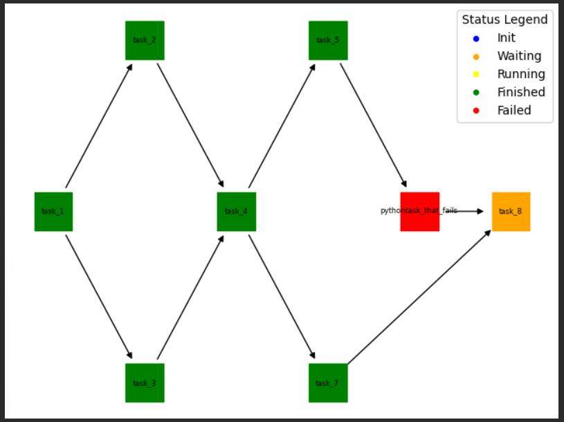

# wrkflw

Simplistic python workflow manager

## Installation
* clone the repo
* `poetry install` (will take care of creating the virtual environment and populating it with all required packages)

## Usage
* see `tests\example_*.py` files for example useage.

## Features
* Can handle python & shell tasks.
* Enforces DAG structure
* Can run a workflow in correct order
* Runs workflow as far as possible when there are failing tasks before halting
* Can reset a job
* Can rerun only the waiting jobs
* Can print a job log and visualise the workflow in matplotlib

## Screenshot

## Contributing

Interested in contributing? Check out the contributing guidelines. Please note that this project is released with a Code of Conduct. By contributing to this project, you agree to abide by its terms.

## License

`wrkflw` was created by Jorrit Vander Mynsbrugge. It is licensed under the terms of the MIT license.

## Credits

`wrkflw` was created with [`cookiecutter`](https://cookiecutter.readthedocs.io/en/latest/) and the `py-pkgs-cookiecutter` [template](https://github.com/py-pkgs/py-pkgs-cookiecutter).
